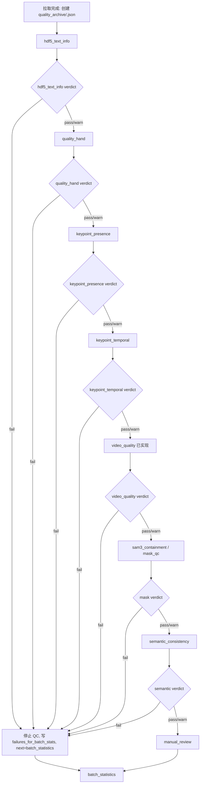

# PRD: Gate 驱动的单条数据 QC JSON 全流程

## 1. Summary

本 PRD 定义机器人数据验收的全流程 JSON 写入规则。目标是让每条数据只有一份主质检档案：

```text
<batch>/quality_archive/<asset_id>.json
```

视频质检模块已经按这个方向实现，本 PRD 重点约束除视频质检之外的模块，包括 HDF5 文本、`quality_hand`、21 点骨骼点、SAM/mask、语义一致性、人工质检、重复检查、有效内容与有效时长。所有模块都必须按 gate 思路读写同一份 JSON。CSV、sidecar、ledger、HTML 只能作为证据或批次派生产物，不能作为单条数据的主报告。

## 2. Contacts

| 角色 | 责任 |
|---|---|
| 验收流程负责人 | 确认 gate 规则、模块顺序、fail/warn/pass 语义。 |
| QC 模块开发同事 | 按本 PRD 修改各模块输出，接入 `quality_archive/<asset_id>.json`。 |
| 人工质检同事 | 只读取 JSON 中的 `manual_review` block 决定是否人工、看哪些问题、写回哪些人工结果。 |
| 批次统计/财务结算同事 | 从 `quality_archive/*.json` 聚合批次台账、问题频率、有效时长和最终批次结论。 |

## 3. Background

当前代码里已经有多类 QC 输出：

- 视频质检已经能写入 `quality_archive/<asset_id>.json`。
- precheck 相关模块会输出 clip aggregates、candidate windows。
- SAM3 containment 会输出 frame/clip/window summary sidecar JSON。
- 人工质检队列会输出 `review_queue.csv`、`manual_labels.csv`、`review_index.html`。
- ledger 会聚合 sidecar/CSV/JSON，生成批次级 CSV/Markdown。

这些输出能支持分析，但不适合作为全流程主档案。用户确认后的最终目标是：

```text
一条数据一份 JSON。
JSON 是这条数据从拉取到最终验收的完整质检报告。
每个模块只追加或更新自己的 block。
fail 立即停止后续 QC，流转到批次统计。
warn 继续流转，把问题写入 manual_review.candidates。
人工质检模块到达时再决定是否需要人工。
```

## 4. Objective

### 4.1 目标

1. 每个 QC 模块都能读取上一模块 gate，并判断自己是否应该运行。
2. 每个 QC 模块都把结果写回同一份 `<asset_id>.json`。
3. 每个模块 block 都有自己的 `flow.entry_gate`、`flow.result_gate`、`flow.exit_gate`。
4. `qc_summary` 只做累计摘要，不再承担唯一流程判断。
5. `manual_review` block 是人工质检模块的唯一入口和出口。
6. 批次报告、Excel、HTML、ledger 全部由 `quality_archive/*.json` 聚合生成。

### 4.2 不做的事

- 不要求所有模块 import 彼此代码。
- 不把 sidecar 大文件、图像、视频帧、mask 二进制写进主 JSON。
- 不让 `qc_summary.overall_verdict` 直接决定下一模块是否运行。
- 不把 hard fail 自动送人工质检。hard fail 直接进入批次统计/返工记录。

### 4.3 成功标准

- 任意抽取一条数据，只看 `<asset_id>.json` 就能知道：
  - 已跑哪些模块。
  - 每个模块是 `pass`、`warn` 还是 `fail`。
  - 下一步是否继续。
  - fail/warn 的具体原因和数值。
  - 是否需要人工质检。
  - 人工质检看过哪些问题，最后确认了什么。
  - 该条数据最终是否进入批次统计、是否有效、有效时长是多少。
- 批次统计脚本可以只输入 `quality_archive/`，不再强依赖散落的 sidecar/CSV。

## 5. Users And Constraints

### 5.1 用户

- 自动 QC pipeline：按 gate 顺序执行模块，减少不必要的高成本模型调用。
- 人工质检人员：只看 JSON 生成的队列和证据，不需要理解每个模块内部计算。
- 供应商验收负责人：根据 JSON 聚合出批次报告、风险点、返工原因和有效时长。

### 5.2 约束

- 路径用相对 batch 根目录的路径，避免写死本机绝对路径。
- 模块更新 JSON 时必须保留未知字段，不允许重写整份 JSON 丢掉其它模块结果。
- 大体积输出只写路径引用，例如 overlay、sidecar、mask summary。
- 同一 issue 的字段命名必须统一，便于人工和批次统计复用。

## 6. Value Proposition

这次改造解决三个问题：

1. **流程可控**：每一步有 gate，fail 后不会继续烧资源跑 mask、SAM、语义模型。
2. **人工可控**：warn 问题先进入 `manual_review.candidates`，是否人工由人工模块统一决定。
3. **报告可信**：一条数据一份档案，批次报告可以追溯到每个模块的数值和原因。

## 7. Solution

## 7.1 总体数据流



核心规则：

- `pass`：记录模块结果，继续下一模块。
- `warn`：记录 warn，追加 `manual_review.candidates`，继续下一模块。
- `fail`：记录 fail，追加 `manual_review.failures_for_batch_stats`，停止后续 QC，`next_module = "batch_statistics"`。

## 7.2 每个模块必须写的通用结构

除 `manual_review` 和 `batch_statistics` 外，每个模块 block 都至少包含：

```json
{
  "flow": {
    "module": "module_name",
    "entry_gate": {
      "state": "ready",
      "eligible": true,
      "blocked_by_module": null,
      "required_inputs": [],
      "missing_inputs": [],
      "upstream_continue": true
    },
    "result_gate": {
      "verdict": "pass",
      "has_fail": false,
      "has_warn": false
    },
    "exit_gate": {
      "state": "continue",
      "continue_to_next_module": true,
      "next_module": "next_module_name",
      "on_pass": "continue",
      "on_warn": "record_warning_and_continue",
      "on_fail": "stop_qc_and_record_batch_statistics"
    }
  },
  "evaluation": {
    "verdict": "pass",
    "passed": true,
    "continue_to_next_module": true,
    "next_module": "next_module_name",
    "reasons": [],
    "warn_reasons": [],
    "reason_details": [],
    "warn_reason_details": []
  },
  "metrics": {},
  "thresholds": {},
  "evidence": {
    "sidecar_paths": [],
    "csv_paths": [],
    "overlay_paths": []
  }
}
```

### 7.2.1 `entry_gate`

| 字段 | 说明 |
|---|---|
| `state` | `ready`、`blocked`、`skipped`。 |
| `eligible` | 当前模块是否应该运行。 |
| `blocked_by_module` | 被哪个上游模块 fail 阻断。没有则为 `null`。 |
| `required_inputs` | 当前模块需要的输入路径或 JSON 字段。 |
| `missing_inputs` | 缺失的输入。缺失导致不能运行时必须写明。 |
| `upstream_continue` | 上游 `exit_gate.continue_to_next_module` 的结果。 |

如果上游已经 fail，当前模块可以不写 block；如果为了可观测性写 block，则必须：

```json
{
  "flow": {
    "entry_gate": {
      "state": "blocked",
      "eligible": false,
      "blocked_by_module": "previous_module",
      "upstream_continue": false
    },
    "result_gate": {
      "verdict": "skipped",
      "has_fail": false,
      "has_warn": false
    },
    "exit_gate": {
      "state": "stop_qc",
      "continue_to_next_module": false,
      "next_module": "batch_statistics"
    }
  }
}
```

### 7.2.2 `result_gate`

| verdict | 含义 |
|---|---|
| `pass` | 当前模块通过。 |
| `warn` | 当前模块发现风险，但不阻断。写入人工候选。 |
| `fail` | 当前模块 hard fail。停止后续 QC。 |
| `skipped` | 没有运行，通常因为上游 fail 或输入缺失且策略为跳过。 |

### 7.2.3 `exit_gate`

| 字段 | 说明 |
|---|---|
| `state` | `continue`、`stop_qc`、`complete_qc`。 |
| `continue_to_next_module` | 下一模块是否可以运行。 |
| `next_module` | 下一模块名；fail 时统一为 `batch_statistics`。 |
| `on_pass/on_warn/on_fail` | 当前模块对三类结果的处理策略。 |

## 7.3 issue 明细标准

所有 `reason_details`、`warn_reason_details`、`manual_review.candidates`、`manual_review.failures_for_batch_stats`、`manual_review.issues` 都使用同一类 issue 字段。

```json
{
  "code": "quality_hand_low_ratio_above_warn",
  "severity": "warn",
  "module": "quality_hand",
  "issue_type": "quality_hand_low",
  "metric": "quality_hand.low_quality_ratio",
  "value": 0.18,
  "threshold": 0.10,
  "comparison": ">",
  "source_level": "asset",
  "window_start_frame": null,
  "window_end_frame": null,
  "representative_frame": null,
  "evidence_path": "quality_sidecars/quality_hand/408817.json",
  "needs_manual_review": true
}
```

必填字段：

| 字段 | 说明 |
|---|---|
| `code` | 稳定原因码，给程序判断用。 |
| `severity` | `warn` 或 `fail`；人工结果里可用 `low/medium/high/critical`。 |
| `module` | 产生问题的模块。 |
| `issue_type` | 稳定问题类型。 |
| `metric` | 对应有问题的指标名。 |
| `value` | 实际值。 |
| `threshold` | 阈值。 |
| `comparison` | 比较关系，例如 `<`、`>`、`!=`。 |
| `needs_manual_review` | 是否作为人工候选。warn 通常为 `true`，fail 通常进入批次统计。 |

推荐 `issue_type` 枚举：

```text
hdf5_text_invalid
quality_hand_low
keypoint_raw_invalid
keypoint_low_quality_window
temporal_jump
severe_keypoint_offset
strong_containment_mismatch
side_view_mask_undersegmentation
occlusion_or_mask_undersegmentation
hand_out_of_frame
projection_review
skeleton_pose_hallucination
video_blur
video_exposure
video_black_screen
video_stutter
semantic_mismatch
duplicate_asset
invalid_content
low_effective_duration
acceptable_minor_misalignment
visual_skeleton_presence_mismatch
unknown
```

## 7.4 顶层 `qc_summary` 更新规则

模块运行后必须同步更新 `qc_summary`。

### pass

- 追加 `completed_modules`。
- 如果没有任何 warn/fail，则 `overall_verdict = "pass"`。
- `status = "running"`。
- `can_continue_qc = true`。
- `next_module = 当前模块 exit_gate.next_module`。

### warn

- 追加 `completed_modules`。
- 追加 `warn_modules`。
- 追加 `warn_reasons` 和 `warn_reason_details`。
- 追加同一批 issue 到 `manual_review.candidates`。
- `overall_verdict = "warn"`。
- `status = "running"`。
- `can_continue_qc = true`。

### fail

- 追加 `completed_modules`。
- 追加 `failed_modules`。
- 追加 `reasons` 和 `reason_details`。
- 追加同一批 issue 到 `manual_review.failures_for_batch_stats`。
- `overall_verdict = "fail"`。
- `status = "stopped"`。
- `hard_failed = true`。
- `first_failed_module` 如果为空，则写当前模块名。
- `passed = false`。
- `can_continue_qc = false`。
- `next_module = "batch_statistics"`。
- 后续 QC 模块不得继续运行。

## 7.5 模块顺序和 block 名

| 顺序 | block 名 | 当前来源 | 下一模块 |
|---:|---|---|---|
| 0 | `asset_profile` | 拉取/建档模块 | `hdf5_text_info` |
| 1 | `hdf5_text_info` | HDF5 文本/结构检查 | `quality_hand` |
| 2 | `quality_hand` | `label/quality_hand` 二元数组检查 | `keypoint_presence` |
| 3 | `keypoint_presence` | 21 点存在性、NaN/Inf、原始结构检查 | `keypoint_temporal` |
| 4 | `keypoint_temporal` | jump、断点、抖动、旋转、候选窗口 | `video_quality` |
| 5 | `video_quality` | 已实现 | `sam3_containment` |
| 6 | `sam3_containment` | 自有/SAM mask 抽检复核 | `semantic_consistency` |
| 7 | `semantic_consistency` | text_label 与图像/动作语义一致性 | `manual_review` |
| 8 | `manual_review` | 人工质检模块 | `batch_statistics` |
| 9 | `duplicate_check` | 全量阶段重复检查 | `content_validity` |
| 10 | `content_validity` | 视频内容是否有效 | `effective_duration` |
| 11 | `effective_duration` | 有效时长计算 | `batch_statistics` |

说明：

- 小批准入口径重点跑 1-8。
- 当前批次全量拉取与台账阶段重点跑 9-11。
- `batch_statistics` 是批次级聚合模块，不一定写入每条 JSON；如果写，也只写消费状态和最终归档状态。

## 7.6 `asset_profile`

### 目的

拉取完成后创建 `<asset_id>.json`，保证后续所有模块都有稳定写入位置。

### JSON block

```json
{
  "asset_profile": {
    "flow": {
      "module": "asset_profile",
      "entry_gate": {
        "state": "ready",
        "eligible": true,
        "blocked_by_module": null,
        "required_inputs": ["source_files"],
        "missing_inputs": [],
        "upstream_continue": true
      },
      "result_gate": {
        "verdict": "pass",
        "has_fail": false,
        "has_warn": false
      },
      "exit_gate": {
        "state": "continue",
        "continue_to_next_module": true,
        "next_module": "hdf5_text_info"
      }
    },
    "supplier_id": "xingjiguitu",
    "batch_id": "XJGT_20260629",
    "asset_id": "408817",
    "created_at": "2026-07-09T00:00:00+08:00",
    "source_files": {
      "video": {
        "path": "video/408817_video.mp4",
        "exists": true
      },
      "hdf5": {
        "path": "hdf5/408817_hdf5.hdf5",
        "exists": true
      }
    }
  }
}
```

### fail 条件

- `asset_id` 为空或无法唯一确定。
- HDF5 和 video 都缺失。
- 同一个 batch 内 `<asset_id>.json` 冲突。

## 7.7 `hdf5_text_info`

### 目的

检查 HDF5 是否能打开、文本字段是否存在、`text_label` 是否能解析、基础字段是否完整。它不做骨骼点质量验收。

### 输入

- `source_files.hdf5.path`

### JSON block

```json
{
  "hdf5_text_info": {
    "flow": {},
    "evaluation": {
      "verdict": "pass",
      "passed": true,
      "continue_to_next_module": true,
      "next_module": "quality_hand",
      "reasons": [],
      "warn_reasons": [],
      "reason_details": [],
      "warn_reason_details": []
    },
    "file_read": {
      "hdf5_open_ok": true,
      "metadata_read_ok": true,
      "file_size_bytes": 123456789
    },
    "text_fields": {
      "attributes": {},
      "datasets": {
        "/label/text_label": {
          "scene": "kitchen",
          "task": "pick cup",
          "text_label": "pick up the red cup"
        }
      }
    },
    "required_fields": {
      "scene": "present",
      "task": "present",
      "text_label": "present",
      "action": "optional_missing"
    },
    "frame_count": {
      "source": "/label/quality_hand",
      "hdf5_frame_count": 908
    },
    "metrics": {
      "parsed_text_field_count": 4,
      "missing_required_field_count": 0,
      "json_parse_error_count": 0
    },
    "thresholds": {
      "missing_required_fields_fail": true,
      "json_parse_error_fail": true
    },
    "evidence": {
      "sidecar_paths": [],
      "csv_paths": [],
      "overlay_paths": []
    }
  }
}
```

### 判定

| 情况 | verdict |
|---|---|
| HDF5 打不开 | fail |
| `text_label` 必填字段缺失 | fail |
| JSON 文本解析失败 | fail |
| 可选字段缺失 | warn |
| 文本正常 | pass |

## 7.8 `quality_hand`

### 目的

检查供应商提供的 `quality_hand` 二元数组是否存在、左右手字段是否可用、低质量帧比例是否异常。它只做粗筛，不判断 21 点位置是否准确。

### 输入

- HDF5 中的 `label/quality_hand` 或适配后的同义字段。

### JSON block

```json
{
  "quality_hand": {
    "flow": {},
    "evaluation": {
      "verdict": "warn",
      "passed": true,
      "continue_to_next_module": true,
      "next_module": "keypoint_presence",
      "reasons": [],
      "warn_reasons": ["quality_hand_low_ratio_above_warn"],
      "reason_details": [],
      "warn_reason_details": [
        {
          "code": "quality_hand_low_ratio_above_warn",
          "severity": "warn",
          "module": "quality_hand",
          "issue_type": "quality_hand_low",
          "metric": "quality_hand.low_quality_ratio",
          "value": 0.18,
          "threshold": 0.10,
          "comparison": ">",
          "needs_manual_review": true
        }
      ]
    },
    "array_info": {
      "path": "/label/quality_hand",
      "present": true,
      "shape": [908, 2],
      "left_column": 0,
      "right_column": 1
    },
    "metrics": {
      "frame_count": 908,
      "left_valid_ratio": 0.96,
      "right_valid_ratio": 0.94,
      "both_hands_low_quality_ratio": 0.02,
      "low_quality_ratio": 0.18,
      "missing_ratio": 0.0
    },
    "thresholds": {
      "missing_fail": true,
      "low_quality_ratio_warn": 0.10,
      "low_quality_ratio_fail": 0.40
    },
    "evidence": {
      "sidecar_paths": [],
      "csv_paths": [],
      "overlay_paths": []
    }
  }
}
```

### 判定

| 情况 | verdict |
|---|---|
| `quality_hand` 缺失或无法读取 | fail |
| shape 不符合配置 | fail |
| 低质量比例超过 fail 阈值 | fail |
| 低质量比例超过 warn 阈值 | warn |
| 正常 | pass |

## 7.9 `keypoint_presence`

### 目的

检查 21 点原始数据是否存在、是否有 NaN/Inf、每帧有效点数量是否足够。这里仍然不做精细语义验收，只做原始可用性。

### 输入

- HDF5 中左右手 21 点。
- 适配器输出的 canonical joint names。

### JSON block

```json
{
  "keypoint_presence": {
    "flow": {},
    "evaluation": {
      "verdict": "pass",
      "passed": true,
      "continue_to_next_module": true,
      "next_module": "keypoint_temporal",
      "reasons": [],
      "warn_reasons": [],
      "reason_details": [],
      "warn_reason_details": []
    },
    "keypoint_source": {
      "coordinate_space": "camera_3d",
      "expected_keypoints_per_hand": 21,
      "hands": ["left", "right"],
      "joint_name_source": "adapter"
    },
    "metrics": {
      "frame_count": 908,
      "left_valid_frame_ratio": 0.98,
      "right_valid_frame_ratio": 0.97,
      "valid_point_ratio": 0.99,
      "missing_frame_ratio": 0.01,
      "nan_count": 0,
      "inf_count": 0,
      "invalid_transform_count": 0,
      "min_valid_points_per_hand": 21
    },
    "bad_segments": [],
    "thresholds": {
      "expected_keypoints_per_hand": 21,
      "min_valid_points_per_hand_warn": 18,
      "min_valid_points_per_hand_fail": 8,
      "missing_frame_ratio_warn": 0.05,
      "missing_frame_ratio_fail": 0.20,
      "nan_or_inf_fail": true
    },
    "evidence": {
      "sidecar_paths": [],
      "csv_paths": [],
      "overlay_paths": []
    }
  }
}
```

### 判定

| 情况 | verdict |
|---|---|
| 21 点字段缺失 | fail |
| NaN/Inf 出现在原始关键点 | fail |
| 有效点数量严重不足 | fail |
| 局部窗口缺点但未严重影响整条数据 | warn |
| 正常 | pass |

## 7.10 `keypoint_temporal`

### 目的

检查 21 点连续性、jump、断点、抖动、旋转异常、侧视/姿态导致的人工候选窗口。该模块主要产生人工候选，不应轻易 hard fail。

### 输入

- `keypoint_presence` 通过后的 canonical keypoints。
- 可选 rotations、cam_pose、fps。

### JSON block

```json
{
  "keypoint_temporal": {
    "flow": {},
    "evaluation": {
      "verdict": "warn",
      "passed": true,
      "continue_to_next_module": true,
      "next_module": "video_quality",
      "reasons": [],
      "warn_reasons": ["temporal_candidate_windows_present"],
      "reason_details": [],
      "warn_reason_details": [
        {
          "code": "temporal_candidate_windows_present",
          "severity": "warn",
          "module": "keypoint_temporal",
          "issue_type": "temporal_jump",
          "metric": "keypoint_temporal.candidate_window_count",
          "value": 2,
          "threshold": 0,
          "comparison": ">",
          "needs_manual_review": true
        }
      ]
    },
    "metrics": {
      "frame_count": 908,
      "fps": 30.0,
      "joint_displacement_m_max": 0.18,
      "joint_acceleration_m_s2_max": 35.0,
      "rotation_delta_max": 22.0,
      "jitter_window_count": 1,
      "candidate_window_count": 2
    },
    "candidate_windows": [
      {
        "window_start_frame": 120,
        "window_end_frame": 150,
        "representative_frame": 136,
        "review_type": ["rotation_manual_review"],
        "trigger_reason": ["rotation_delta_high"],
        "trigger_metrics": {
          "rotation_delta_max": 42.0
        },
        "needs_manual_review": true,
        "sam3_containment_eligible": true
      }
    ],
    "thresholds": {
      "joint_displacement_m_warn": 0.12,
      "joint_displacement_m_fail": 0.50,
      "joint_acceleration_m_s2_warn": 30.0,
      "rotation_delta_deg_warn": 35.0
    },
    "evidence": {
      "sidecar_paths": ["qc_sidecars/keypoint_temporal/408817_candidate_windows.json"],
      "csv_paths": [],
      "overlay_paths": []
    }
  }
}
```

### 判定

| 情况 | verdict |
|---|---|
| 原始关键点不可信，已经无法做连续性 | fail |
| 明显物理不可能的巨大跳变 | fail |
| 有 jump/抖动/侧视/旋转候选窗口 | warn |
| 正常 | pass |

### 写入 `manual_review.candidates`

每个 `candidate_windows[]` 都应转换成一个 `manual_review.candidates[]` item。必须保留：

- `module = "keypoint_temporal"`
- `source_level = "window"`
- `window_start_frame`
- `window_end_frame`
- `representative_frame`
- `issue_type`
- `metric/value/threshold/comparison`
- `evidence_path`

## 7.11 `sam3_containment`

### 目的

复核自有/SAM mask 与 21 点投影的一致性。它消费 keypoint 候选窗口，也可以对 pass 样本做抽样。该模块可以生成 sidecar，但主结果必须写回 `<asset_id>.json`。

### 输入

- `keypoint_temporal.candidate_windows`
- 视频帧或抽帧路径。
- SAM/self mask sidecar。
- camera intrinsics 或投影结果。

### JSON block

```json
{
  "sam3_containment": {
    "flow": {},
    "evaluation": {
      "verdict": "warn",
      "passed": true,
      "continue_to_next_module": true,
      "next_module": "semantic_consistency",
      "reasons": [],
      "warn_reasons": ["side_view_manual_review"],
      "reason_details": [],
      "warn_reason_details": [
        {
          "code": "side_view_manual_review",
          "severity": "warn",
          "module": "sam3_containment",
          "issue_type": "side_view_mask_undersegmentation",
          "metric": "sam3_containment.inside_ratio_mean",
          "value": 0.42,
          "threshold": 0.60,
          "comparison": "<",
          "window_start_frame": 464,
          "window_end_frame": 502,
          "representative_frame": 480,
          "needs_manual_review": true
        }
      ]
    },
    "metrics": {
      "sampled_window_count": 4,
      "checked_frame_count": 80,
      "inside_ratio_mean": 0.73,
      "strong_fail_frame_count": 0,
      "projection_review_frame_count": 2,
      "acceptable_frame_count": 78,
      "mask_available_ratio": 0.98
    },
    "window_results": [
      {
        "window_start_frame": 464,
        "window_end_frame": 502,
        "representative_frame": 480,
        "window_containment_verdict": "side_view_manual_review",
        "inside_ratio_mean": 0.42,
        "strong_fail_frame_count": 0,
        "source_review_type": ["side_view_manual_review"],
        "source_needs_manual_review": true,
        "source_sam3_containment_eligible": false,
        "reason": "side-view hand orientation makes SAM containment unreliable"
      }
    ],
    "thresholds": {
      "inside_ratio_warn": 0.60,
      "inside_ratio_fail": 0.30,
      "strong_fail_frame_count_fail": 3,
      "mask_available_ratio_fail": 0.70
    },
    "evidence": {
      "sidecar_paths": [
        "qc_sidecars/sam3_containment/408817_window_summary.json"
      ],
      "csv_paths": [],
      "overlay_paths": [
        "review_assets/overlays/408817_464_502.png"
      ]
    }
  }
}
```

### 判定

| 情况 | verdict |
|---|---|
| mask 大面积不可用，且无法复核 | warn 或 fail，按配置 |
| 强 containment mismatch 且不是侧视/遮挡可解释 | fail |
| 侧视、旋转、投影边界、轻微 mismatch | warn |
| 正常 | pass |

## 7.12 `semantic_consistency`

### 目的

检查 `text_label` 与图像/动作是否一致。它可以使用 LLM/VLM 或轻量规则，不要求在当前阶段跑重模型，但 JSON block 要先固定。

### 输入

- `hdf5_text_info.text_fields`
- 视频抽帧或关键窗口。
- 可选 mask/keypoint evidence。

### JSON block

```json
{
  "semantic_consistency": {
    "flow": {},
    "evaluation": {
      "verdict": "warn",
      "passed": true,
      "continue_to_next_module": true,
      "next_module": "manual_review",
      "reasons": [],
      "warn_reasons": ["semantic_object_mismatch"],
      "reason_details": [],
      "warn_reason_details": [
        {
          "code": "semantic_object_mismatch",
          "severity": "warn",
          "module": "semantic_consistency",
          "issue_type": "semantic_mismatch",
          "metric": "semantic_consistency.object_match_score",
          "value": 0.45,
          "threshold": 0.60,
          "comparison": "<",
          "needs_manual_review": true
        }
      ]
    },
    "text_label_snapshot": {
      "scene": "kitchen",
      "task": "pick red cup",
      "objects": ["red cup"],
      "action": "pick"
    },
    "metrics": {
      "scene_match_score": 0.90,
      "object_match_score": 0.45,
      "action_match_score": 0.70,
      "no_action_duration_sec": 0.3
    },
    "model_info": {
      "method": "vlm_or_rule",
      "model_name": "configured_by_runtime",
      "prompt_version": "semantic_consistency_v1"
    },
    "sampled_frames": [
      {
        "frame_idx": 120,
        "image_path": "review_assets/frames/408817_120.jpg",
        "observation": "red cup not visible"
      }
    ],
    "thresholds": {
      "object_match_score_warn": 0.60,
      "object_match_score_fail": 0.30,
      "no_action_duration_sec_warn": 1.0
    },
    "evidence": {
      "sidecar_paths": [],
      "csv_paths": [],
      "overlay_paths": []
    }
  }
}
```

### 判定

| 情况 | verdict |
|---|---|
| 明确 text_label 和视频内容完全不一致 | fail |
| 物体/动作/场景低置信不一致 | warn |
| 正常 | pass |

## 7.13 `manual_review`

### 目的

人工模块不重新跑 QC。它只做三件事：

1. 读取 `manual_review.candidates`。
2. 结合 pass sample 策略决定 `required`。
3. 将人工结果写入 `manual_review.issues` 和 `manual_review.flow`。

### 输入

- `manual_review.candidates`
- `manual_review.pass_sample_eligible`
- 可选 pass sample 抽样规则。
- 人工导出的 `manual_labels.csv`。

### JSON block

```json
{
  "manual_review": {
    "state": "completed",
    "required": true,
    "selection_policy": "manual_review_module_decides_from_warn_candidates",
    "candidates": [],
    "failures_for_batch_stats": [],
    "selected_items": [
      {
        "review_id": "supplier_a_408817_464_502_0001",
        "source_module": "sam3_containment",
        "issue_type": "side_view_mask_undersegmentation",
        "window_start_frame": 464,
        "window_end_frame": 502
      }
    ],
    "issues": [
      {
        "module": "manual_review",
        "source_module": "sam3_containment",
        "review_id": "supplier_a_408817_464_502_0001",
        "asset_id": "408817",
        "source_level": "window",
        "window_start_frame": 464,
        "window_end_frame": 502,
        "representative_frame": 480,
        "auto_verdict": "fail",
        "issue_type": "side_view_mask_undersegmentation",
        "failure_mode": "side_view_mask_undersegmentation",
        "severity": "medium",
        "confidence": "high",
        "label": "positive",
        "manual_outcome": "true_positive",
        "suggested_issue_type": "side_view_mask_undersegmentation",
        "reason_code": "manual_review_confirmed_issue",
        "reason": "side-view hand orientation makes SAM containment unreliable",
        "comment": "confirmed by reviewer",
        "reviewer": "reviewer_name",
        "needs_manual_review": false
      }
    ],
    "pass_sample_eligible": false,
    "reviewed_count": 1,
    "flow": {
      "module": "manual_review",
      "entry_gate": {
        "state": "ready",
        "eligible": true,
        "blocked_by_module": null,
        "required_inputs": [
          "manual_review.candidates",
          "manual_review.pass_sample_eligible"
        ],
        "missing_inputs": []
      },
      "result_gate": {
        "verdict": "fail",
        "has_fail": true,
        "has_warn": false
      },
      "exit_gate": {
        "state": "stop_qc",
        "continue_to_next_module": false,
        "next_module": "batch_statistics"
      }
    }
  }
}
```

### 人工结果枚举

| 字段 | 枚举 |
|---|---|
| `manual_outcome` | `true_positive`、`false_positive`、`acceptable_flagged`、`partial`、`review`、`false_negative` |
| `label` | `positive`、`acceptable_flagged`、`review` |
| `failure_mode` | 使用 issue_type 枚举 |
| `severity` | `low`、`medium`、`high`、`critical` |
| `confidence` | `low`、`medium`、`high` |

### 判定

| 人工结果 | 对最终 QC 的影响 |
|---|---|
| `true_positive` | 人工确认问题，通常置为 fail。 |
| `partial` | 部分确认，按配置 fail 或 warn。 |
| `false_positive` | 自动问题误报，不影响通过。 |
| `acceptable_flagged` | 有问题但可接受，记 risk/warn。 |
| `false_negative` | 人工发现漏检，置为 fail。 |

## 7.14 `duplicate_check`

### 目的

全量阶段检查重复数据、重复片段、重复 asset_id、重复文件指纹。

### 输入

- `asset_id`
- HDF5/video 文件路径。
- 文件 hash、视频 perceptual hash、时间戳、text_label hash。

### JSON block

```json
{
  "duplicate_check": {
    "flow": {},
    "evaluation": {
      "verdict": "pass",
      "passed": true,
      "continue_to_next_module": true,
      "next_module": "content_validity",
      "reasons": [],
      "warn_reasons": [],
      "reason_details": [],
      "warn_reason_details": []
    },
    "fingerprints": {
      "hdf5_sha256": "abc",
      "video_sha256": "def",
      "text_label_hash": "ghi",
      "video_phash": "jkl"
    },
    "metrics": {
      "duplicate_group_size": 1,
      "max_video_similarity": 0.12,
      "time_overlap_ratio": 0.0
    },
    "duplicates": [],
    "thresholds": {
      "video_similarity_warn": 0.92,
      "video_similarity_fail": 0.98,
      "time_overlap_ratio_fail": 0.90
    },
    "evidence": {
      "sidecar_paths": [],
      "csv_paths": [],
      "overlay_paths": []
    }
  }
}
```

### 判定

| 情况 | verdict |
|---|---|
| 同一文件 hash 重复 | fail |
| 高相似视频且时间/文本高度重叠 | fail |
| 疑似重复但证据不足 | warn |
| 无重复 | pass |

## 7.15 `content_validity`

### 目的

判断视频内容是否有效。比如 text_label 描述动作，但视频里长时间无关、无动作、空镜、无手、目标物不存在。

### 输入

- `video_quality`
- `semantic_consistency`
- 可选人工/模型抽帧结果。

### JSON block

```json
{
  "content_validity": {
    "flow": {},
    "evaluation": {
      "verdict": "warn",
      "passed": true,
      "continue_to_next_module": true,
      "next_module": "effective_duration",
      "reasons": [],
      "warn_reasons": ["invalid_content_segment_present"],
      "reason_details": [],
      "warn_reason_details": []
    },
    "metrics": {
      "total_duration_sec": 30.0,
      "invalid_content_duration_sec": 1.6,
      "invalid_content_ratio": 0.053,
      "no_action_duration_sec": 1.2,
      "no_hand_visible_duration_sec": 0.4
    },
    "invalid_segments": [
      {
        "start_frame": 120,
        "end_frame": 156,
        "duration_sec": 1.2,
        "reason": "no action related to text_label"
      }
    ],
    "thresholds": {
      "invalid_content_duration_sec_warn": 1.0,
      "invalid_content_ratio_fail": 0.90
    },
    "evidence": {
      "sidecar_paths": [],
      "csv_paths": [],
      "overlay_paths": []
    }
  }
}
```

### 判定

| 情况 | verdict |
|---|---|
| 无效内容占比极高 | fail |
| 无关内容超过配置阈值 | warn |
| 正常 | pass |

## 7.16 `effective_duration`

### 目的

计算结算/台账用的有效时长。总时长减去无效内容、重复片段、hard fail 片段。

### 输入

- `video_quality.metadata.duration_seconds`
- `content_validity.invalid_segments`
- `duplicate_check.duplicates`
- 人工质检确认的无效片段。

### JSON block

```json
{
  "effective_duration": {
    "flow": {},
    "evaluation": {
      "verdict": "pass",
      "passed": true,
      "continue_to_next_module": true,
      "next_module": "batch_statistics",
      "reasons": [],
      "warn_reasons": [],
      "reason_details": [],
      "warn_reason_details": []
    },
    "metrics": {
      "total_duration_sec": 30.0,
      "invalid_duration_sec": 1.6,
      "duplicate_duration_sec": 0.0,
      "effective_duration_sec": 28.4,
      "effective_ratio": 0.947
    },
    "deducted_segments": [
      {
        "source_module": "content_validity",
        "start_frame": 120,
        "end_frame": 156,
        "duration_sec": 1.2,
        "reason": "no action related to text_label"
      }
    ],
    "thresholds": {
      "effective_duration_sec_fail": 0.0,
      "effective_ratio_warn": 0.80
    },
    "evidence": {
      "sidecar_paths": [],
      "csv_paths": [],
      "overlay_paths": []
    }
  }
}
```

### 判定

| 情况 | verdict |
|---|---|
| 有效时长为 0 | fail |
| 有效比例低于 warn 阈值 | warn |
| 正常 | pass |

## 7.17 `batch_statistics`

### 目的

批次统计模块从 `quality_archive/*.json` 聚合，不是单条数据 QC 的前置模块。

### 输入

- 整个 batch 的 `quality_archive/*.json`。

### 输出

允许输出：

```text
reports/batch_qc_ledger.csv
reports/issue_events.csv
reports/supplier_issue_frequency.csv
reports/batch_report.md
reports/batch_report.xlsx
```

如果需要在单条 JSON 中记录已被批次统计消费，可以写：

```json
{
  "batch_statistics": {
    "consumed": true,
    "batch_id": "XJGT_20260629",
    "final_asset_verdict": "pass",
    "risk_level": "low",
    "top_issue_types": [],
    "effective_duration_sec": 28.4
  }
}
```

但批次统计不得覆盖前面模块的原始结果。

## 7.18 sidecar、CSV、ledger 的定位

| 类型 | 是否主报告 | 用途 |
|---|---|---|
| `<asset_id>.json` | 是 | 单条数据全流程 QC source of truth。 |
| sidecar JSON | 否 | 大量 frame/window 明细、模型输出、overlay 索引。主 JSON 只引用路径和摘要。 |
| CSV | 否 | 给人工或表格工具查看的派生文件。 |
| ledger events | 否 | 从主 JSON 聚合出来的批次级事件表。 |
| batch report | 否 | 从主 JSON 聚合出来的批次报告。 |

## 8. Release Plan

### V1: 统一写入 helper

实现共享工具，建议放在 `qc_common/asset_qc_report.py`：

- `load_asset_qc_report(path)`
- `write_asset_qc_report(path, report)`
- `build_module_flow(module, verdict, next_module, required_inputs, missing_inputs, upstream_continue)`
- `append_module_result(report, module, block, issues)`
- `append_manual_candidates(report, issues)`
- `append_failures_for_batch_stats(report, issues)`
- `mark_stopped(report, module, issues)`

验收：

- 更新 JSON 时保留未知字段。
- fail/warn/pass 三种路径都有单元测试。
- 同一 issue 重跑不会无限重复追加。

### V2: precheck 模块接入主 JSON

改造：

- `hdf5_text_info`
- `quality_hand`
- `keypoint_presence`
- `keypoint_temporal`

验收：

- 旧的 clip aggregates / candidate windows 可以继续输出，但必须同步写回 `<asset_id>.json`。
- `manual_review.candidates` 中能看到 keypoint temporal 的窗口问题。
- fail 后不会继续进入后续模块。

### V3: SAM3/mask 模块接入主 JSON

改造：

- `sam3_containment`
- `visual_coverage_sidecar` 消费端

验收：

- sidecar 仍可保存 frame 级明细。
- 主 JSON 有窗口级摘要、问题数值、overlay 路径。
- strong fail、side-view warn、projection review 都能正确写入。

### V4: 语义一致性和人工质检闭环

改造：

- `semantic_consistency`
- `manual_review`

验收：

- 人工模块只读 `manual_review.candidates` 和 pass sample 策略。
- 人工结果写回 `manual_review.issues`。
- 人工确认 fail 后，`qc_summary.status = "stopped"`，`next_module = "batch_statistics"`。

### V5: 批次统计只读主 JSON

改造：

- `build_batch_qc_ledger.py`
- `build_manual_review_queue.py`
- `build_batch_qc_report.py`

验收：

- 只输入 `quality_archive/` 能生成完整 ledger、issue events、Excel/Markdown 报告。
- 旧 sidecar/CSV 输入仅作为兼容 fallback。

## 9. Acceptance Criteria

1. 每个模块都有自己的 block。
2. 每个模块 block 都有 `flow.entry_gate`、`flow.result_gate`、`flow.exit_gate`。
3. 每个 warn 都能在 `manual_review.candidates` 找到对应 issue 和具体数值。
4. 每个 fail 都能在 `manual_review.failures_for_batch_stats` 找到对应 issue 和具体数值。
5. fail 后后续 QC 模块不运行，`pipeline_state.next_module = "batch_statistics"`。
6. 人工质检完成后，人工结果写回 `manual_review.issues`。
7. 批次统计能从 `quality_archive/*.json` 聚合出完整质量报告。
8. 旧 sidecar/CSV 不再是主报告，只能作为证据路径或兼容输入。

## 10. Implementation Notes

- 模块写 JSON 时，先读取旧 JSON，修改自己的 block，再写回。
- 不要在模块之间直接 import 业务逻辑。模块之间通过 JSON 和文件路径通信。
- 旧字段可以保留，但新逻辑优先读标准 block。
- `qc_summary.overall_verdict` 是累计摘要，不是下一模块唯一入口。
- 下一模块应优先读上一模块 `flow.exit_gate.continue_to_next_module`。
- 所有路径建议相对 batch 根目录。
- 所有阈值写入对应模块 `thresholds`，便于复现当时判断。
- 所有问题都必须带 `metric`、`value`、`threshold`、`comparison`，人工质检不能只看到一句原因。
