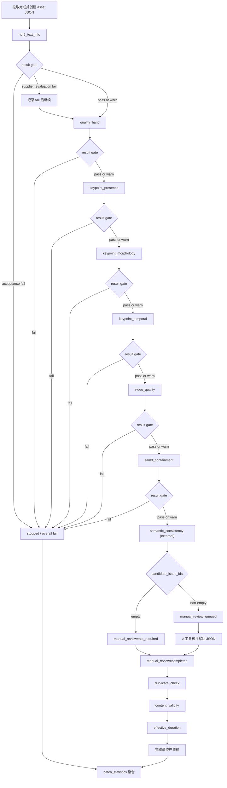

# PRD: Gate 驱动的单资产 QC JSON 全流程

## 1. 文档状态

| 项目 | 状态 |
|---|---|
| 单资产 JSON 与 gate 合同 | `asset_qc_report.v2` 已实现 |
| 统一配置 loader/schema | `qc_acceptance_config_schema.v2` 已实现 |
| 配置版本 | `qc_acceptance_v2.1.0` |
| 自动模块适配与双 profile orchestrator | 已实现 |
| 人工/语义阶段接口 | `execution_kind: external`，由外部工作台接续 |
| 批次投影、缓存与 ledger 入口 | 已切换为 `quality_archive/*.json` |

本页原有 v1 章节保留作为历史迁移参考；当前生产合同以本文末尾“v2 canonical
contract”为准。模块源码仍由各模块负责人维护，但所有正式写回和统计都必须遵守
v2 报告事务、profile 和唯一事实源规则。

## 2. 核心结论

每条数据只有一份主质检档案：

```text
<batch>/quality_archive/<asset_id>.json
```

它从拉取完成后创建，一直伴随该资产走完整个 QC 流程：

```text
创建档案 -> 自动 QC gate 串行执行 -> warn 累积 -> 人工路由 -> 后续批次检查 -> 批次统计
```

当前不可变规则：

1. `asset_qc_report.v2` 是每条数据唯一主报告；正式批次输出只投影
   `quality_archive/*.json`。
2. `acceptance` profile 的自动 hard fail 写入 `stopped`/`overall_decision=fail`，
   跳过后续模块、语义阶段和人工候选；`supplier_evaluation` profile 的同一 fail
   写入机器 fail 并 `record_and_continue`，直到全流程结束仍保留最终 fail。
3. 自动 warn 只累计到 `manual_review.candidate_issue_ids`。语义阶段
   `semantic_consistency` 是外部阶段；语义完成且候选为空时人工状态为
   `not_required`，有候选时为 `queued`。
4. runtime error、revision/CAS 冲突、配置漂移和 evidence 完整性错误不是质量
   fail；它们写入 `runtime_errors`，状态为 `error`，`overall_decision=null`。
5. 下游只读结构化 gate/status，不解析自然语言 reason；sidecar 只作证据和对账，
   不得覆盖主报告 verdict。

## 3. 目标与非目标

### 3.1 目标

- 只读一个 JSON 就知道该资产跑过哪些模块、当前在哪一步、下一步是什么。
- 每个 warn/fail 都有稳定 code、实际值、触发边界和 rule ID。
- 高成本模块在上游 fail 后不会继续消耗资源。
- 人工质检只读 JSON 即可知道是否需要人工、需要看什么、证据在哪里。
- 批次统计只聚合 `quality_archive/*.json` 就能形成验收报告。
- 模块并行开发时互不覆盖彼此字段。

### 3.2 非目标

- 不把所有 QC 模块合并进一个 Python 文件。
- 不把视频帧、mask、overlay 等大对象直接嵌入 JSON。
- 不要求 acceptance hard fail 再走语义或人工确认；hard fail 直接记录并停止。
- 不使用 CSV、cache、sidecar 或 ledger 代替单资产主档案；sidecar 只作证据。
- 不把 `supplier_evaluation` 的 fail 改写为 warn/pass，也不删除其批次统计事实。

## 4. 流程图



模块顺序、profile 行为和 external 边界以该资产顶层 `qc_config` 指向的
`qc_acceptance_v2.1.0` 版本化配置为准。`supplier_evaluation` 的 fail 分支会
汇入同一条“记录 fail 后继续”路径；图中的 acceptance hard fail 才会进入停止节点。

## 5. 单资产 JSON 顶层合同

```json
{
  "schema_version": "asset_qc_report.v2",
  "qc_config": {
    "schema_version": "qc_acceptance_config_schema.v2",
    "config_version": "qc_acceptance_v2.1.0",
    "config_name": "acceptance_gate",
    "config_path": "configs/qc_acceptance.yaml",
    "config_hash": "sha256:..."
  },
  "asset_id": "episode_000123",
  "supplier_id": "supplier-a",
  "report_revision": 7,
  "execution": {
    "profile": "acceptance",
    "started_at": "2026-07-14T10:00:00Z",
    "updated_at": "2026-07-14T10:05:00Z",
    "module_states": {}
  },
  "pipeline_state": {
    "status": "running",
    "last_completed_module": "video_quality",
    "next_module": "sam3_containment",
    "stop_reason": null
  },
  "overall_decision": null,
  "runtime_errors": [],
  "issues": [],
  "manual_review": {
    "required": null,
    "state": "not_evaluated",
    "candidate_issue_ids": [],
    "failures_for_batch_stats_issue_ids": []
  },
  "source_files": {},
  "hdf5_text_info": {},
  "quality_hand": {},
  "keypoint_presence": {},
  "keypoint_morphology": {},
  "keypoint_temporal": {},
  "video_quality": {},
  "sam3_containment": {},
  "semantic_consistency": {},
  "duplicate_check": {},
  "content_validity": {},
  "effective_duration": {}
}
```

模块尚未执行时可以没有对应 block，不要提前写空 block 冒充已运行。

## 6. 流程状态

### 6.1 顶层状态

| `pipeline_state.status` | 含义 | `overall_decision` |
|---|---|---|
| `pending` | 已建档，等待第一个或下一个模块。 | `null` |
| `running` | 自动/人工 QC 仍在执行。 | `null` |
| `awaiting_external` | 到达 `semantic_consistency` 或 `manual_review` 外部工作台，等待写回。 | `null` |
| `stopped` | `acceptance` profile 的自动 hard fail，流程提前终止。 | `fail` |
| `completed` | 所有应运行模块和外部阶段完成。 | `pass` 或 `fail` |
| `error` | runtime/evidence/config/CAS 错误，未形成质量结论。 | `null` |

`pending`、`running`、`awaiting_external` 和 `error` 只表示流程状态，不表示质量。
`warn` 是 issue 的机器严重级别，不是 `overall_decision`；最终结论只允许 `pass`、
`fail` 或未完成时的 `null`。

### 6.2 模块 gate

每个自动 QC block 必须写：

```json
{
  "module_version": "module-specific-version",
  "flow": {
    "entry_gate": {
      "state": "ready",
      "eligible": true,
      "blocked_by_module": null,
      "required_inputs": [],
      "missing_inputs": [],
      "upstream_continue": true
    },
    "result_gate": {
      "verdict": "warn",
      "has_fail": false,
      "has_warn": true
    },
    "exit_gate": {
      "state": "continue",
      "continue_to_next_module": true,
      "next_module": "next_module_name"
    }
  },
  "evaluation": {
    "decision": "warn",
    "reasons": [],
    "warn_reasons": ["stable_reason_code"],
    "issue_ids": ["module_name:stable_reason_code:001"]
  },
  "metrics": {},
  "evidence": {}
}
```

### 6.3 Gate 转换表

| profile/模块 verdict | issue | 出口 | 顶层状态 | 下一步 |
|---|---|---|---|---|
| 任一 profile + `pass` | 无 | `continue` | `running` | 配置中的下一模块 |
| 任一 profile + `warn` | 生成 warn issue | `continue` | `running` | 配置中的下一模块 |
| `acceptance` + `fail` | 生成 fail issue | `stop_qc` | `stopped` | `batch_statistics` |
| `supplier_evaluation` + `fail` | 生成 fail issue，`continued_after_fail=true` | `continue` | `running` | 配置中的下一模块 |
| `skipped`/disabled/external | 必须记录结构化 state | `continue`、`awaiting_external` 或 `stop_qc` | 按策略 | 显式写出 |

输入缺失若使模块无法完成必要检查，通常应生成 fail issue，而不是把 `skipped`
当成无问题。可选模块被配置关闭时才使用普通 skipped。

## 7. Issue 合同

所有模块共享顶层 `issues` 数组。每个触发条件单独一个对象：

```json
{
  "issue_id": "video_quality:fps_below_pass:001",
  "code": "fps_below_pass",
  "severity": "warn",
  "module": "video_quality",
  "issue_type": "low_fps",
  "metric": "video_basic.fps",
  "observed_value": 22.5,
  "operator": "<",
  "boundary_value": 24.0,
  "rule_id": "video_quality.fps_below_pass",
  "needs_manual_review": true,
  "context": {}
}
```

要求：

- 多个异常指标生成多个 issue。
- `issue_id` 在单个 asset 内唯一且稳定。
- `code` 用于 UI/报表展示映射，不能是任意自然语言。
- `rule_id` 必须在统一 config 登记且全局唯一。
- `observed_value` 和 `boundary_value` 可以是结构，但必须可 JSON 序列化。
- 帧区间、可靠性、source path 等放入 `context`。
- 模块 block 只保存 `issue_ids`，不复制完整 issue。
- config 版本只写顶层 `qc_config`，issue 内不重复。

## 8. 人工质检输入与输出

### 8.1 自动模块如何提供人工输入

自动模块遇到 warn 时：

1. 写顶层 warn issue。
2. 设置 `needs_manual_review`。
3. 将 `issue_id` 追加到 `manual_review.candidate_issue_ids`。
4. 继续后续自动模块。

`acceptance` 自动模块 fail 时：

1. 写顶层 fail issue。
2. 将 `issue_id` 追加到
   `manual_review.failures_for_batch_stats_issue_ids`。
3. 设置 `manual_review.required=false`、
   `manual_review.state=skipped_due_to_fail`。
4. 停止后续 QC、语义阶段和人工质检，直接进入批次统计；后续模块标记
   `skipped_due_to_fail`。

`supplier_evaluation` 自动模块 fail 时仍写 fail issue 和
`failures_for_batch_stats_issue_ids`，但不停止流程；模块 block 的 runtime 写入
`continued_after_fail=true`，最终全流程完成后 `overall_decision=fail`。

### 8.2 语义与人工外部阶段

`semantic_consistency` 和 `manual_review` 在统一 Config 中是
`execution_kind: external`。orchestrator 到达任一阶段时只写
`pipeline_state.status=awaiting_external`、`next_module` 和对应
`execution.module_states.<module>.state=awaiting_external`，不会伪造模型结论。
Warn 人工质检先完成；全 Pass 或 `not_required` 后，独立语义工作台才能读取任务。
语义实现后续可替换为模型 adapter，报告接口不变。

自动阶段完成后按累计 warn 候选路由：

- `manual_review.candidate_issue_ids=[]`：写 `required=false`、`state=not_required`，
  不做正常 Pass 样本抽检；
- 非空：当前 `all_candidates` 策略将完整候选池快照到 `selected_issue_ids`，写
  `selection_policy=all_candidates`、`required=true`、`state=queued`；
- 复核过程中使用 `in_progress`，全部写回后使用 `completed`；
- acceptance hard fail 已停止时使用 `skipped_due_to_fail`，不创建人工任务。

人工全部 Pass 时把 pipeline cursor 推进到 `semantic_consistency`；任一人工 Fail 使用
`completion_mode=early_fail` 终止资产并标记语义 `skipped_due_to_fail`。没有候选的
`not_required` 资产直接推进语义。

人工 verdict 只能补充 issue review 和统计，不得删除/改写机器 issue；人工确认 fail
会进入 `human_confirmed_fail_issue_count` 和最终 fail 统计。

`candidate_issue_ids` 始终是完整机器候选池，`selected_issue_ids` 是本次任务快照；
已有非空快照不得覆盖。未来可以用抽样、风险或预算 selector 替换
`all_candidates`，但候选池合同不变。

### 8.3 人工路由模块

到达 `manual_review` 时，路由器只需要读取：

```text
pipeline_state
manual_review.candidate_issue_ids
issues
source_files
各 issue 的 context/evidence path
统一 config 的 manual_review 策略；语义模块不读取人工工作台内部状态
```

路由结果建议写：

```json
{
  "required": true,
  "state": "queued",
  "candidate_issue_ids": ["video_quality:fps_below_pass:001"],
  "selected_issue_ids": ["video_quality:fps_below_pass:001"],
  "selection_policy": "all_candidates",
  "failures_for_batch_stats_issue_ids": [],
  "routing": {
    "policy": "warn_or_sample",
    "reason_codes": ["warn_issue_present"],
    "sampled": false,
    "queue_id": "manual-review-20260710-001"
  },
  "reviews": []
}
```

`required=null` 只允许出现在尚未到达人工路由时。路由完成后必须是布尔值。

### 8.3 人工写回

每个被复核 issue 写一条结构化记录：

```json
{
  "review_id": "review-000001",
  "issue_id": "video_quality:fps_below_pass:001",
  "reviewer": "reviewer_id",
  "reviewed_at": "2026-07-10T10:00:00+08:00",
  "verdict": "accept_issue",
  "asset_action": "accept_with_risk",
  "comment": "动作连续，低 FPS 对当前任务可接受。",
  "evidence_paths": []
}
```

允许的 issue verdict：

```text
accept_issue
reject_issue
unable_to_determine
```

允许的资产动作：

```text
accept
accept_with_risk
reject
return_for_rework
```

人工模块完成时：

- 所有 selected issue 都必须有 review。
- `state=completed`。
- 写 reviewer、时间和最终 `asset_action`。
- 人工结论不得删除或篡改机器 issue 的观测值。
- `reject` / `return_for_rework` 使流程停止并形成 fail。
- `accept` / `accept_with_risk` 继续配置中的下一模块。

## 9. 各模块写入要求

以下均为其他模块同事的实现合同；视频模块除外。

### 9.1 `hdf5_text_info`

必须写：

- HDF5 是否可打开、文本字段是否可读取；
- `scene`、`task` 及可选 `text_label/text_en/action/subtask` 的源值；
- 缺失字段、类型错误和解析错误 issue；
- HDF5 相对路径与 dataset 路径；
- flow、evaluation、metrics、evidence。

不得让视频模块代写该 block。

### 9.2 `quality_hand`

必须写：

- 原始 `quality_hand` 值；
- shape、左右手映射和合法值检查；
- 单手低质量/both hands 低质量 issue；
- 统计值和源 dataset 路径。

### 9.3 `keypoint_presence`

必须写：

- 左右手期望点数和每帧有效点数；
- 缺失帧比例、NaN/Inf 数量、连续缺失窗口；
- 每个异常的区间或帧索引证据；
- 是否达到 warn/fail 边界。

### 9.4 `keypoint_morphology`

必须写：

- 骨长、掌宽、关节角等启用指标；
- 异常手侧、关节、帧区间；
- 归一化口径和参考配置 rule ID；
- 聚合异常比例及 gate 结论。

### 9.5 `keypoint_temporal`

必须写：

- jump、断点、抖动、漂移、长时间静止等已启用指标；
- 帧区间、时长和 hand side；
- 可区分关键点数据静止与视频 confirmed freeze 的证据。

### 9.6 `video_quality` 已实现

当前实现写：

- 基础视频可用性、FPS、显示分辨率；
- PTS 连续性、估算缺帧、抽样解码；
- 黑帧、过暗、过曝；
- 全帧 Laplacian/Tenengrad 清晰度代理；
- low-motion、freeze candidate、confirmed freeze、冻结区间；
- 视频状态与 HDF5 motion conflict；
- 总瑕疵时长比例；
- HDF5 帧数对齐；
- gate、顶层 issue、manual candidate 和 pipeline state。

视频模块不计算手部 ROI，也不写 HDF5 文本、关键点质量、mask 或语义 block。
`should_run_mask_qc` 仅为兼容字段，跨模块运行以 exit gate 为准。

### 9.7 `sam3_containment`

必须写：

- 抽样策略和抽中的 frame/window；
- hand/object mask 可用率；
- containment、IoU、边界距离等实际启用指标；
- 风险区间与 overlay/sidecar 相对路径；
- 不把逐像素 mask 放进主 JSON。

### 9.8 `semantic_consistency`

必须写：

- 输入 text 字段和模型/规则版本；
- 图像/视频与 text 的匹配结论、置信度和理由码；
- 抽样帧或证据路径；
- 无法判断与明确不一致必须分开编码。

### 9.9 `duplicate_check`

必须写：

- 使用的时间戳、asset ID、文件指纹或特征版本；
- exact/near duplicate 类型；
- matched asset IDs、相似度和重复区间；
- 原始资产与保留/剔除建议。

### 9.10 `content_validity`

必须写：

- 是否存在与任务无关的长片段；
- 无效区间、时长、比例和 text/task 依据；
- 有效/无效边界的证据路径；
- 明确区分 unknown 与 invalid。

### 9.11 `effective_duration`

必须写：

- 原始总时长；
- 黑屏、冻结、重复、无效内容等扣减区间；
- 区间去重合并后的扣减时长；
- 最终有效时长和比例；
- 扣减项引用来源 issue ID，避免重复扣除。

## 10. 模块所有权与写回

每个模块只能拥有：

```text
自己的 <module_name> block
自己产生的顶层 issue
自己 issue 对应的 manual_review ID 引用
自己推进后的 pipeline_state
report_revision + 1
```

不得：

- 删除未知字段；
- 删除其他模块 issue；
- 重写其他模块 metrics；
- 改变既有顶层 `qc_config`；
- 把 revision 从旧值直接覆盖；
- 未通过 schema 就落盘。

写回顺序：读取 -> 校验 config/revision -> 合并自己的内容 -> revision 加 1 ->
schema 校验 -> 临时文件 `fsync` -> 原子替换。

## 11. Sidecar、CSV 与 Ledger Events

### 11.1 Sidecar

sidecar 是模块的大体积明细文件，例如逐帧 SAM 指标或完整候选窗口。sidecar 只作证据
和旧系统对账，不能作为正式 verdict、人工队列或批次统计的事实源。主 JSON 只写：

```json
{
  "evidence": {
    "sidecar_paths": ["qc_evidence/sam3/episode_000123.json"]
  }
}
```

它不是第二份主质检报告；sidecar 缺失只能记录 evidence integrity/runtime error，
不能由聚合器猜测 pass/fail。

### 11.2 CSV

CSV 是队列或批次表格视图，例如 review queue。它必须可由 asset JSON 重建，不能
保存 JSON 中没有的唯一结论。

### 11.3 Ledger Events

ledger event 是“模块开始、结束、重试、写回”等事件日志，用于审计和监控。最终
质量事实仍写回 asset JSON；事件日志不能作为人工质检唯一输入。

## 12. 批次统计

`batch_statistics` 不再运行高成本 QC，只遍历并校验 `quality_archive/*.json` 聚合：

- `overall_decision` 和停止模块；
- 自动 hard fail 资产/issue 数量（含 supplier_evaluation 的记录后继续 fail）；
- 机器 warn、人工已检查、人工确认 fail 和最终 pass/fail 数量；
- issue code/type/rule ID 频率；
- 人工结论、返工项和风险项；
- 重复率、无效时长、有效时长；
- config version/hash 分布；
- 供应商、scene、task 等分层结果。

批次统计必须保留 asset ID 和 issue ID 追溯链。

正式 projection 允许写 CSV/XLSX/Markdown/Parquet 和可重建 cache；这些派生文件都
必须带 source report `relative_path`、revision、SHA-256 清单。清单不一致时先重建，
不能继续使用旧 cache 作结论。

## 13. 开发验收清单

每个同事提交模块时必须证明：

- [ ] 从统一 config 读取自己的阈值和 rule ID。
- [ ] entry/result/exit gate 完整。
- [ ] pass/warn/fail 与本 PRD 一致。
- [ ] warn 继续；acceptance fail 停止并转 batch statistics，supplier_evaluation fail
      记录后继续且最终仍为 fail。
- [ ] 每个异常生成独立 issue，包含实际值和边界。
- [ ] 模块只引用 issue ID，不复制 issue detail。
- [ ] 保留未知字段和其他模块 block。
- [ ] revision 冲突会失败，不会静默覆盖。
- [ ] 写入前通过 JSON Schema。
- [ ] 使用原子写入。
- [ ] 单元测试覆盖 pass、warn、fail、blocked、重复写入和 config 不一致。
- [ ] 文档示例与真实 writer 输出一致。

## 14. 当前提交边界

本次可合并内容：

- 统一 config loader 和 schema；
- `qc_acceptance_v2.1.0` 活动/归档配置；
- `asset_qc_report.v2` schema、迁移器和 CAS writer；
- 新 `video_quality` gate、issue、config 和 JSON 输出；
- 本 PRD、统一 config PRD 和视频使用文档。

本次不包含：

- HDF5 文本、`quality_hand`、关键点、SAM3、语义、人工、重复、内容有效性、
  有效时长模块的源码改造；
- 全流程 orchestrator；
- 人工 review UI。

这些由对应同事按本 PRD 后续提交。

## 15. v2 canonical contract（当前生产接口）

以下规则覆盖本文早期 v1 示例：

```text
schema_version: asset_qc_report.v2
config schema: qc_acceptance_config_schema.v2
config version: qc_acceptance_v2.1.0
active config: configs/qc_acceptance.yaml
immutable snapshot: configs/qc_acceptance/qc_acceptance_v2.1.0.yaml
archive: <batch>/quality_archive/<asset_id>.json
```

Config 必须声明两个 profile：

```yaml
execution_profiles:
  acceptance:
    fail_action: stop
    runtime_error_action: stop_incomplete
  supplier_evaluation:
    fail_action: record_and_continue
    runtime_error_action: stop_incomplete
```

两种 profile 共享机器 `result_gate.verdict`。只有流转动作不同：acceptance 的
hard fail 为 `pipeline_state.status=stopped`、`overall_decision=fail`；
supplier_evaluation 的 hard fail 记录 `continued_after_fail=true` 并继续，完成所有
应运行/外部阶段后才以 `overall_decision=fail` 收口。runtime error 不属于质量 fail，
写 `runtime_errors[]`、模块状态 `runtime_error`、顶层 `status=error` 和
`overall_decision=null`。

### 15.1 统一数据流

```text
自动 QC Gate
  acceptance: hard fail -> stopped/fail；不进入语义和人工质检
  supplier_evaluation: hard fail -> 记录并继续
-> semantic_consistency external
-> candidate_issue_ids 为空：manual_review=not_required
-> candidate_issue_ids 非空：manual_review=queued
-> 最终 overall_decision=pass|fail
-> 批次输出只投影 quality_archive/*.json
```

`semantic_consistency` 是自动链上的外部阶段，不与人工 warn review 并列；人工
校准先写回语义 block，未来模型接入保持同一 external 边界。人工候选状态只能是
`not_evaluated`、`not_required`、`required`、`queued`、`in_progress`、`completed`
或 `skipped_due_to_fail`。

### 15.2 写回、证据与并发

- `evidence.path` 必须是相对于 batch root 的路径，禁止绝对路径、`..` 越界路径。
- writer 读取当前 `report_revision`，校验 asset/config/profile/next_module，按模块
  所有权替换内容，revision 加 1，通过 v2 Schema 后临时文件 `fsync` + `os.replace`。
- expected revision 不匹配必须失败（CAS/stale revision），不能静默覆盖其他 writer。
- master verdict 仅来自 QC JSON；sidecar 只作证据和 reconciliation，不能覆盖
  `overall_decision`、机器 severity 或人工 effective verdict。
- v1 报告只读；首次 v2 写回必须先 `migrate_v1_to_v2()` 并通过 v2 schema。失败或
  回滚时只能读取 v1/写旁路迁移报告，禁止把旧内容覆盖回 master QC verdict。

### 15.3 正式 CLI 与可重建 cache

```bash
# 人工候选队列：正式模式只读 quality_archive/*.json
python tools/build_manual_review_queue.py \
  --quality-archive sampled/XJGT_20260616/quality_archive \
  --output-dir sampled/XJGT_20260616/manual_review

# 三张规范化投影 + 汇总；cache 可删除、可重建，不是事实源
python tools/build_qc_json_projection.py \
  --quality-archive sampled/XJGT_20260616/quality_archive \
  --output-dir sampled/XJGT_20260616/qc_projection \
  --cache-dir sampled/XJGT_20260616/qc_cache \
  --formats csv parquet xlsx markdown

# 兼容入口仍从同一 QC JSON 投影；legacy 参数只生成 reconciliation 表
python tools/build_batch_qc_ledger.py \
  --quality-archive sampled/XJGT_20260616/quality_archive \
  --output-dir sampled/XJGT_20260616/ledger \
  --formats csv parquet xlsx markdown

python tools/build_xjgt_acceptance_report.py \
  --quality-archive sampled/XJGT_20260616/quality_archive \
  --output-dir sampled/XJGT_20260616/xjgt_report
```

正式输出只能解释 `quality_archive/*.json`；传入旧 candidate/SAM3/video/manual
sidecar 时，它们只进入 reconciliation/evidence，不得改变 canonical asset、issue、
execution 行或 aggregate verdict。
