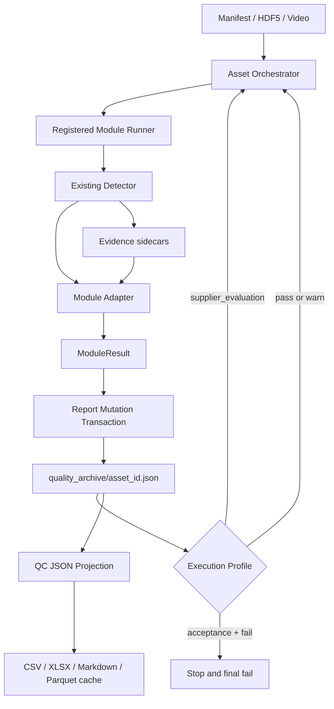

# 统一 QC 数据流技术设计

## 1. 目标与边界

本设计把仓库内已经合入的 Precheck、关键点质量、视频质量、SAM3 和批次报表统一到一条可恢复的数据流：版本化 Config 决定模块与规则，模块结果经适配器写入单资产 QC JSON，执行 profile 决定 fail 是否截断，批次报表只投影 QC JSON。

本 change 不重写检测算法，不实现人工语义时间轴或 warn Pass/Fail 工作台，也不把当前没有实现的 duplicate/content/effective-duration 模块伪装成通过。人工阶段由 `add-human-semantic-warn-review` 在本设计提供的接口上实现。

## 2. 当前问题

当前实现存在四个数据断点：

1. `acceptance_pull.video_quality` 已经通过 `qc_common.report` 原子写入 `quality_archive/<asset_id>.json`，其他模块仍输出独立 JSON/Parquet/CSV。
2. `configs/qc_acceptance.yaml` 声明完整模块顺序和 `aggregate_from_quality_archive_only`，但没有统一 orchestrator 消费这些配置。
3. `asset_qc_report.v1` 只严格定义 `video_quality`，无法校验其他模块、两种 execution profile 和运行错误。
4. 多套 ledger/report 直接解释 candidate windows、SAM3 summary、video sidecar 和 manual CSV，可能得到与单资产报告不同的最终结论。

## 3. 方案选择

采用“适配器 + 报告事务 + 资产编排器”。

- 适配器保留现有检测器及其测试，只将结果归一为统一合同。
- 报告事务集中处理模块所有权、稳定 issue、revision、候选重建和原子替换。
- 资产编排器按 Config 和 execution profile 运行，机器 verdict 与实际流转动作分开记录。

不采用直接重写全部检测器，因为它会把算法回归与数据流改造绑定；不采用离线 sidecar 拼装，因为它不能执行 Gate、并发控制或中断恢复。

## 4. 目标数据流



同一资产内部只允许一个模块事务运行；不同资产可以并行。批次并发只调度 asset worker，不允许多个 worker 同时写同一资产报告。

## 5. 版本化 Config v2

### 5.1 文件与版本策略

- 活跃入口：`configs/qc_acceptance.yaml`
- 不可变快照：`configs/qc_acceptance/qc_acceptance_v2.0.0.yaml`
- Schema：`schemas/qc_acceptance_config.v2.schema.json`
- `schema_version`：`qc_acceptance_config_schema.v2`
- `config_version`：`qc_acceptance_v2.0.0`

历史 `qc_acceptance_v1.1.0.yaml` 保持字节和 hash 不变。活跃入口必须与 v2.0.0 快照字节一致；后续任何规则、顺序、profile 或路由变化都发布新版本，禁止修改已有快照。

### 5.2 核心结构

```yaml
schema_version: qc_acceptance_config_schema.v2
config_version: qc_acceptance_v2.0.0
config_name: acceptance_gate

execution_profiles:
  acceptance:
    fail_action: stop
    runtime_error_action: stop_incomplete
  supplier_evaluation:
    fail_action: record_and_continue
    runtime_error_action: stop_incomplete

pipeline:
  default_profile: acceptance
  modules:
    - hdf5_text_info
    - quality_hand
    - keypoint_presence
    - keypoint_morphology
    - keypoint_temporal
    - video_quality
    - sam3_containment
    - semantic_consistency
    - manual_review
    - duplicate_check
    - content_validity
    - effective_duration

modules:
  keypoint_temporal:
    enabled: true
    implementation: precheck.keypoint_temporal
    parameters: {}
    rules: {}
```

Config loader 除 Schema 校验外还必须检查：

- pipeline 中的每个模块都存在配置；
- `rule_id` 全局唯一；
- execution profile 引用合法动作；
- enabled 模块有明确 implementation 或 execution kind；
- 同一资产继续运行时 config version/hash 与报告一致；
- 活跃入口与不可变快照一致。

### 5.3 尚未实现模块

`duplicate_check`、`content_validity` 和 `effective_duration` 当前没有可调用实现。v2 默认配置将它们保留在声明顺序中，但设置 `enabled: false` 和结构化 `disabled_reason: no_registered_implementation`。它们不会被写成 Pass；后续实现完成时必须发布新的 Config 版本后才能启用。

`semantic_consistency` 和 `manual_review` 是外部人工阶段，v2 将其声明为 `execution_kind: external`。本 change 的自动 orchestrator 到达它们时写入 awaiting 状态并暂停；依赖 change 完成后由同一流程继续。

现有 `annotation_verify.instruction_consistency` 仍是未实现模型判断的 stub，不得注册为已完成的语义模块。

## 6. 单资产报告 v2

### 6.1 Schema 与兼容策略

- 新 Schema：`schemas/asset_qc_report.v2.schema.json`
- `schema_version`：`asset_qc_report.v2`
- 保留现有字段名 `overall_decision`，不新增同义的 `final_decision`
- v1 报告可以只读并投影到 v2；任何后续正式写入都必须先纯函数迁移并通过 v2 Schema

### 6.2 顶层结构

```json
{
  "schema_version": "asset_qc_report.v2",
  "asset_id": "100003",
  "report_revision": 7,
  "qc_config": {
    "schema_version": "qc_acceptance_config_schema.v2",
    "config_version": "qc_acceptance_v2.0.0",
    "config_name": "acceptance_gate",
    "config_path": "configs/qc_acceptance/qc_acceptance_v2.0.0.yaml",
    "config_hash": "sha256:..."
  },
  "execution": {
    "profile": "acceptance",
    "started_at": "...",
    "updated_at": "..."
  },
  "pipeline_state": {
    "status": "running",
    "last_completed_module": "keypoint_temporal",
    "next_module": "video_quality",
    "stop_reason": null
  },
  "overall_decision": null,
  "source_files": {},
  "issues": [],
  "runtime_errors": [],
  "manual_review": {},
  "hdf5_text_info": {},
  "quality_hand": {},
  "keypoint_presence": {},
  "keypoint_morphology": {},
  "keypoint_temporal": {},
  "video_quality": {},
  "sam3_containment": {}
}
```

### 6.3 业务状态与运行状态

`overall_decision` 只有三种存储值：流程未完成时为 `null`，最终完成后为 `pass` 或 `fail`。

`pipeline_state.status` 表达运行过程，可取：

- `pending`
- `running`
- `awaiting_external`
- `stopped`
- `completed`
- `error`

运行错误不等于质量失败。`status=error` 时 `overall_decision` 必须为 `null`。准入模式自动 hard fail 时 `status=stopped`、`overall_decision=fail`；供应商测评模式自动 fail 后仍保持 running，直到全流程完成后才形成 fail。

## 7. 统一内部合同

### 7.1 文件边界

```text
qc_common/
  contracts.py          # ModuleResult / Issue / EvidenceRef / enums
  report.py             # 低层 load + validate + atomic replace
  report_mutation.py    # 模块所有权与报告归并事务
  module_registry.py    # 模块实现注册
  config.py             # v1/v2 Config loader

qc_pipeline/
  orchestrator.py       # 资产状态机与 profile
  context.py            # AssetContext / source files
  adapters/
    precheck.py
    video_quality.py
    sam3_containment.py

qc_reporting/
  projection.py         # QC JSON -> 规范化资产/issue 行
  aggregate.py          # 批次统计
  cache.py              # 可重建缓存
```

### 7.2 `ModuleResult`

```python
@dataclass(frozen=True)
class ModuleResult:
    module: str
    verdict: Literal["pass", "warn", "fail", "skipped"]
    evaluation: dict[str, Any]
    metrics: dict[str, Any]
    issues: tuple[Issue, ...]
    evidence: tuple[EvidenceRef, ...]
    runtime: dict[str, Any]
```

Adapter 只能返回该合同，不能自行决定下一个模块、最终结论或写完整报告。

### 7.3 稳定 Issue ID

Issue ID 使用规范化身份字段计算：

```text
asset_id
module
rule_id
source-relative-path
coordinate-system
start-frame
end-frame
hand-side
evidence-kind
```

字段以稳定 JSON 编码后计算 SHA-256，最终格式为 `<module>:<rule-name>:<20-hex>`。自然语言 reason、运行时间和浮点展示字符串不得进入 ID，避免重跑漂移。

### 7.4 Evidence 引用

主报告不嵌入逐像素 mask、整段视频或大量逐帧记录。`EvidenceRef` 保存：

- evidence ID 和类型；
- 相对批次根目录路径；
- source coordinate system；
- 起止帧和 hand side；
- 可选 checksum、MIME type 和生成器版本。

路径必须相对化并禁止跳出批次根目录。sidecar 丢失属于 evidence integrity error，不允许聚合器反向猜测结论。

## 8. 模块适配映射

| PRD 模块 | 当前实现来源 | v2 处理 |
|---|---|---|
| `hdf5_text_info` | `precheck.text_integrity` | 映射源字段、解析错误、dataset 路径和 issue |
| `quality_hand` | `precheck.quality_score` | 映射原值、shape、手侧和质量规则 |
| `keypoint_presence` | `keypoint_missing`、`skeleton_quality_score` 的 presence 证据 | 合并有效点数、NaN/Inf、连续缺失窗口 |
| `keypoint_morphology` | `precheck.keypoint_morphology` | 映射骨长、掌宽、角度和异常区间 |
| `keypoint_temporal` | `precheck.keypoint_temporal` 与 candidate windows | 映射 jump/抖动/漂移/静止和人工候选 |
| `video_quality` | batch runner 与 manifest range runner | 统一为一个 adapter 和报告事务入口 |
| `sam3_containment` | manifest SAM3 summary/overlay | 映射窗口 verdict、containment 指标和 evidence |

`composite_frame_verdict` 是派生诊断，不创建独立 PRD module block；它只能作为相关模块 evidence 或调试 sidecar。

现有 runner 中的硬编码或局部 Config 必须通过 adapter construction 映射到统一 Config 参数。迁移时保持当前有效数值不变，并用 golden test 证明；迁移完成后统一 Config 是阈值唯一来源。

## 9. 报告事务算法

`apply_module_result()` 执行以下固定步骤：

1. 读取报告；不存在则用 asset/source/config/profile 初始化 v2。
2. 若读取到 v1，执行纯函数 `migrate_v1_to_v2()`，不立即写盘。
3. 校验 expected revision、asset ID、Config version/hash 和当前 `next_module`。
4. 根据模块所有权删除该模块旧 block、旧 issue 和旧 evidence 引用。
5. 写入新 module block，并按稳定 ID 合并本模块 issues/evidence。
6. 从所有顶层 issue 重建 `manual_review.candidate_issue_ids` 和自动 fail 统计引用，禁止增量列表漂移。
7. 根据 profile 计算 `exit_gate` 和下一 pipeline state；`result_gate.verdict` 不被 profile 改写。
8. 仅在所有必需阶段完成时计算 `overall_decision`。
9. revision 加一，执行 v2 Schema 校验，以同目录临时文件、fsync 和 `os.replace` 原子提交。

报告事务失败时不得留下半更新 JSON。stale revision、模块顺序不匹配、Config hash 漂移和 Schema 错误均为显式异常。

## 10. Orchestrator 状态机

### 10.1 Acceptance

```text
module pass  -> next
module warn  -> record candidate -> next
module fail  -> stopped -> overall_decision=fail
runtime error -> error -> overall_decision=null
external stage -> awaiting_external
```

自动 hard fail 后，orchestrator 将后续自动模块和外部人工阶段标记为 `skipped_due_to_fail`，不创建语义或 warn 人工任务。

### 10.2 Supplier evaluation

```text
module pass  -> next
module warn  -> record candidate -> next
module fail  -> record fail + continued_after_fail -> next
runtime error -> error -> overall_decision=null
external stage -> awaiting_external
```

机器 fail 不会被改写为 warn/pass。全流程完成后只要存在任一自动 hard fail，`overall_decision=fail`。

### 10.3 恢复与幂等

orchestrator 以报告 `next_module` 为恢复点。模块 adapter 必须能对同一 asset/context 幂等重跑；报告事务按模块所有权替换旧结果。若 sidecar 已存在，runner 依据显式 overwrite/resume 策略复用或重建，不能仅因文件存在就假定 QC JSON 已完成。

## 11. 人工阶段接口

本 change 不实现 UI，但必须提供后续 change 所需状态：

- `manual_review.candidate_issue_ids`：所有机器 warn 候选，稳定去重；
- `manual_review.failures_for_batch_stats_issue_ids`：自动 hard fail 引用；
- `manual_review.state`：`not_evaluated`、`not_required`、`queued`、`in_progress`、`completed`、`skipped_due_to_fail`；
- `pipeline_state.status=awaiting_external` 与 `next_module`；
- issue context/evidence 中的问题帧范围和 overlay/clip 引用。

所有自动检查 Pass、语义阶段完成且候选为空时，后续 reducer 将人工质检设为 `not_required`，不做正常样本抽检。

## 12. 批次统计投影

正式聚合入口只接受批次根目录或 `quality_archive/`。读取器校验每份报告并输出三类规范化表：

1. asset rows：profile、pipeline status、overall decision、模块覆盖率；
2. issue rows：机器 severity、effective verdict、模块、rule、帧区间；
3. execution rows：模块状态、耗时、继续-after-fail、runtime error。

核心统计至少包含：

- 总资产数、完成数、未完成数；
- 自动 hard-fail 资产数和 issue 数；
- 机器 warn 资产数和 issue 数；
- 人工检查/消解/确认 fail（在依赖 change 写入后生效）；
- 最终 pass/fail 资产数和通过率；
- 两种 profile 分组的模块覆盖率与停止位置。

CSV、XLSX、Markdown 和 Parquet 都由同一投影生成。Parquet/CSV 缓存写入 source report revision/hash 清单；清单不一致时全量或按资产重建。

## 13. 错误处理

| 错误 | 处理 |
|---|---|
| 输入文件缺失/不可读 | 记录 runtime error，`overall_decision=null` |
| enabled 模块未注册 | `module_unavailable`，流程 error，不得 Pass |
| 模块算法正常产出 fail | 按 profile stop 或 continue |
| sidecar 写入失败 | 模块 runtime error，不提交成功 module result |
| QC JSON stale revision | 拒绝提交，由 orchestrator 重新加载后决定重试 |
| Config hash 漂移 | 停止并要求使用原快照恢复 |
| Schema 校验失败 | 不替换原报告，输出精确 JSON path |
| 单个资产失败 | 不影响其他资产 worker；批次汇总显示未完成 |

运行错误和质量失败必须在类型、字段和报表指标上完全分离。

## 14. 测试策略

### 14.1 合同测试

- Config v2 合法/非法 profile、重复 rule ID、模块缺失和快照 hash。
- Asset report v2 各 pipeline status 与 `overall_decision` 条件约束。
- v1 只读迁移，确保 video block、unknown fields 和 revision 保留。
- 稳定 issue ID 对重跑一致，对帧区间/手侧变化敏感。

### 14.2 报告事务测试

- 本模块重跑只替换本模块字段。
- 其他模块和未知扩展字段保持不变。
- candidate/fail 引用从 issues 全量重建并去重。
- stale revision、Config 漂移和 Schema 失败不破坏原文件。

### 14.3 Adapter Golden Tests

每个 adapter 使用固定遗留输入 fixture，断言完整 module block、issues、evidence 和 verdict。Golden 数据覆盖无异常、warn、fail、缺字段和坐标系转换。

### 14.4 Orchestrator Tests

同一组 stub modules 分别运行 acceptance 与 supplier_evaluation：

- pass → warn → pass；
- pass → fail → 后续模块；
- runtime error；
- external pending；
- 中断后从 `next_module` 恢复。

### 14.5 端到端与回归

- 使用小型 HDF5、视频和 SAM3 fixture 生成完整 revision 轨迹。
- 对现有 detector 运行原回归测试，确保阈值和 sidecar 行为不变。
- 对同一 fixture 比较旧 ledger 和新投影，差异必须有明确迁移解释。
- 删除所有派生缓存后仅凭 QC JSON 重建相同统计。

## 15. 实施顺序

1. 发布 Config v2 和 asset report v2 Schema及迁移器。
2. 实现 contracts、稳定 issue ID、报告事务和 registry。
3. 接入 Precheck 的五个 PRD 模块。
4. 统一 batch/manifest video adapter。
5. 接入 SAM3 adapter 与 evidence。
6. 实现双 profile orchestrator 和恢复。
7. 将人工队列输入改为 QC JSON 投影。
8. 将正式批次报表改为 QC JSON 聚合。
9. 同步 PRD、格式文档、操作指南并执行端到端验证。

每一步均先添加失败测试，再实现最小功能；完成后单独提交，避免在同一提交混合 Schema、adapter 和报表迁移。

## 16. 完成标准

- 仓库已有自动模块均通过统一 adapter 写入 `asset_qc_report.v2`。
- Config v2 是模块顺序、阈值、rule 和 profile 的唯一来源。
- acceptance 与 supplier_evaluation 对同一 fail 产生相同机器 verdict、不同 exit gate。
- sidecar 不再被正式决策或批次聚合直接解释。
- 所有正式批次输出可以只凭 `quality_archive/*.json` 重建。
- 未实现模块、运行错误和未完成人工阶段不会产生虚假 Pass。
- 全量测试通过，PRD、Schema 和 reviewer 文档与代码一致。
